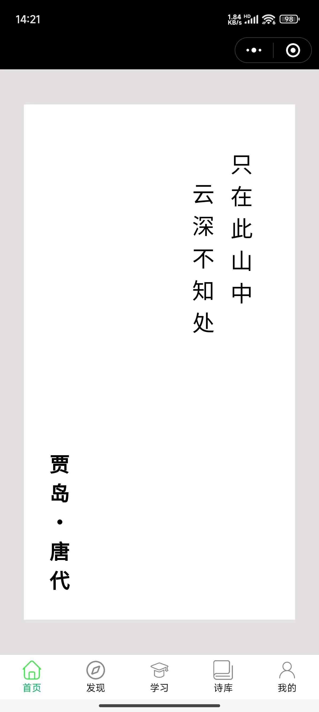
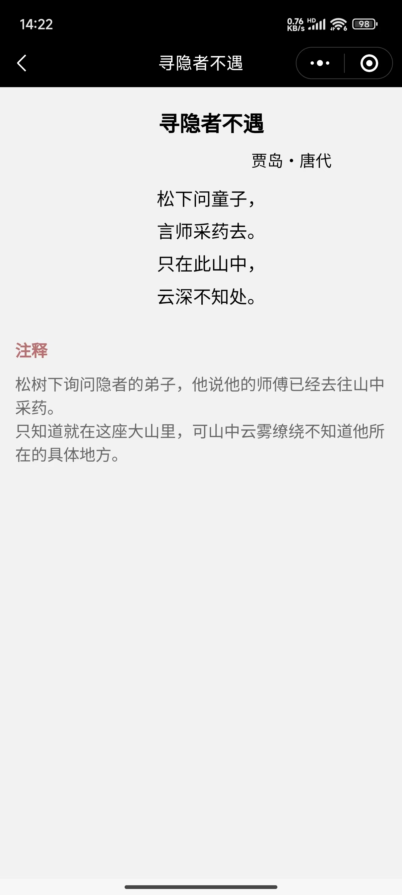
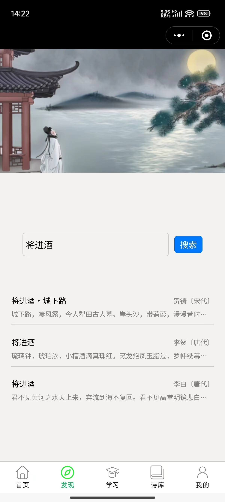
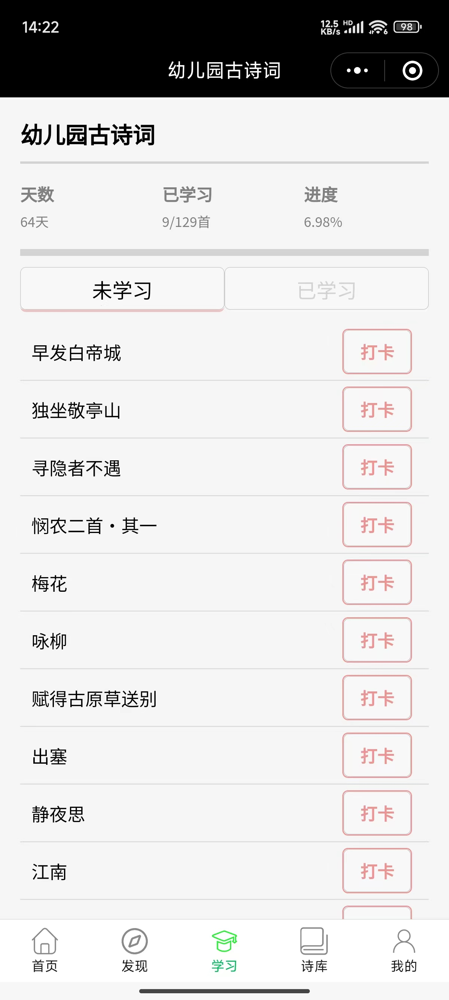
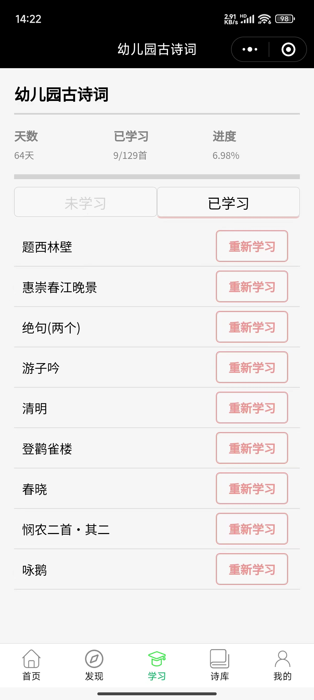
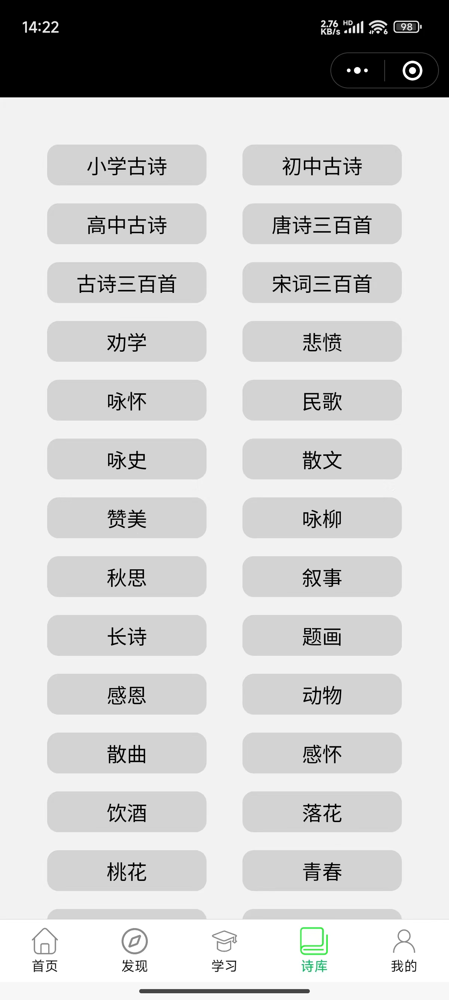
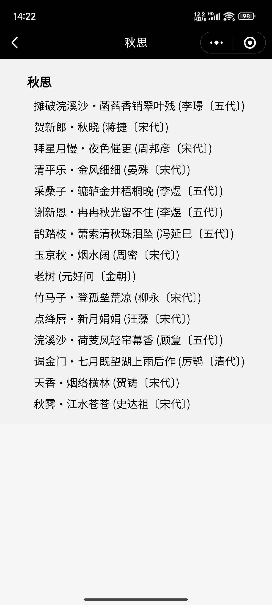

# 一木古诗词

**原生微信小程序，学习古诗词。**  
对应后端服务：https://github.com/stepheng-ky/studypoem_server  

## 功能介绍
### 一、首页
**显示名句卡片**
1. 名句卡片，随机展示一首诗的名句  
2. 点击卡片，可跳转到该诗词详情页  

### 二、诗词详情页
**显示诗词详细内容**
1. 标题  
2. 作者朝代  
3. 诗词内容，居中展示
4. 注释

### 三、发现
**关键字搜索诗词、作者、朝代**
1. 页面上方1/3位置随机显示某一首诗的banner图，点击可跳转诗词详情
2. banner图下方是搜索框，输入搜索内容，点击搜索按钮，展示搜索结果

### 四、学习
**用户默认的学习计划详情**
1. 上方显示计划名称
2. 计划名称下方侠士学习进度，包括学习天数、已学习数、进度百分比
3. 学习内容分为未学习标签和已学习标签
4. 未学习标签，显示所有未学习的古诗词，按用户指定顺序显示，点击右侧【**打卡**】按钮，可将诗词状态改为已学习
5. 已学习标签，显示所有已学习古诗词，按打卡时间倒序排列，点击右侧【**重新学习**】按钮，可将诗词状态改为未学习
6. 学习计划名称右侧，点击管理可以进入计划管理页面

### TODO: 五、学习计划管理
**管理用户的学习计划**
1. 显示该用户所有的学习计划
2. 用户可以新建学习计划、复制系统计划为个人计划、删除计划
3. 点击任一计划右侧设置默认，可以将该计划设置为默认，学习页面就会展示该计划详情
4. 点击任一计划，可以进入计划详情页面

### TODO: 六、计划详情
**管理学习计划详情**
1. 显示该计划所有诗词以及状态
2. 上下拖动可以调整诗词默认顺序
3. 可以新增、删除诗词，新增诗词可以弹出搜索页面进行搜索
4. 可以修改计划名称

### 七、诗库
**展示所有诗词分类**
1. 显示所有诗词分类
2. 点击任一分类，可以跳转分类详情

### 八、诗词分类详情
**显示该分类的所有诗词**
1. 显示该分类所有诗词
2. 点击任一诗词，可以跳转到该诗词详情页

### TODO：我的
**显示、管理个人信息**
1. 个人信息
2. 收藏诗词
3. 已学习诗词总列表

### TODO：微信授权功能
**用户进入小程序，提示用户授权，用来新建、认证账号**

### TODO：
1. 每首诗新增背景图
2. 每首诗新增朗读语音-可用ai生成
3. 用户【打卡】新增上传朗读音频
4. 诗词详情页新增个人的朗读音频播放按钮
5. 加载页面过程中先加加载中的显示
6. 搜索结果显示优化
7. 诗的朗诵按钮，改为图标
8. 诗词详情 字体大小，居中样式优化

## DEMO图
   
   
   
   
   
   
   

## 配置
- config.js  
export const API_BASE_URL = 'https://domain.com';
